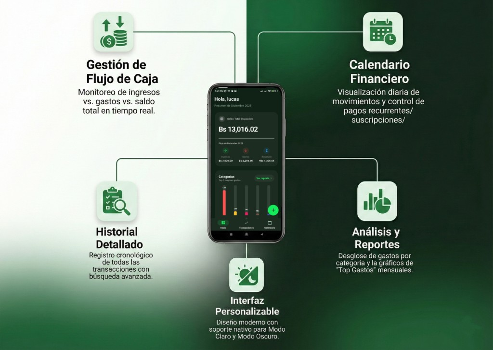

# Finance Local 📱💸


**Finance Local** es una aplicación móvil diseñada para la gestión de finanzas personales bajo la filosofía **"Offline First"**. Desarrollada con Flutter, prioriza la privacidad del usuario, el rendimiento inmediato y la seguridad de los datos sin depender de conexión a internet.

> 🚀 **Estado:** En producción (Google Play Store).
> 🎓 **Proyecto:** Trabajo Freelance / Portafolio Profesional.

---

## Caracteristicas Funcionales

|  | 

---

## ✨ Características Principales

* **100% Offline & Privada:** Los datos viven en el dispositivo del usuario, no en la nube. Cero rastreo.
* **Base de Datos NoSQL (Hive):** Implementación de almacenamiento local de alto rendimiento mediante cajas binarias (Boxes), permitiendo lectura/escritura en microsegundos.
* **Gestión de Transacciones:** Algoritmos optimizados para el registro de Ingresos, Gastos y Categorías personalizadas.
* **Reportes Inteligentes:** Gráficos estadísticos y cálculos de balance mensual en tiempo real.
* **Matemática Financiera Robusta:** Implementación de lógica de sanitización de decimales (`double` sanitization logic) para evitar errores de punto flotante en cálculos monetarios.
* **UI/UX Adaptativa:** Diseño responsivo con soporte nativo para **Modo Oscuro** y **Modo Claro**.

---

## 🛠️ Arquitectura e Ingeniería

El proyecto sigue los principios de **Clean Architecture** para garantizar escalabilidad, testabilidad y separación de responsabilidades:

1.  **Domain Layer:** Entidades y Lógica de Negocio pura (independiente de Flutter).
2.  **Data Layer:** Implementación de Repositorios, Modelos (Adapters de Hive) y fuentes de datos locales.
3.  **Presentation Layer:** Gestión de estado (Provider/Bloc) y Widgets UI.

### Stack Tecnológico

* **Framework:** Flutter & Dart.
* **Base de Datos:** Hive (Key-Value NoSQL database).
* **Gestión de Estado:** (Aquí pon: Provider o Bloc, según lo que usaste).
* **Gráficos:** Fl_chart.
* **Internacionalización:** Soporte configurado para formato de moneda local (Bolivia - Bs).

---

## 🚀 Instalación y Despliegue

Este proyecto requiere el SDK de Flutter instalado.

1.  **Clonar el repositorio:**
    ```bash
    git clone [https://github.com/ElTapiaGit/finance-local-app.git](https://github.com/ElTapiaGit/finance-local-app.git)
    ```

2.  **Instalar dependencias:**
    ```bash
    flutter pub get
    ```

3.  **Generar adaptadores de Hive (Code Generation):**
    ```bash
    dart run build_runner build
    ```

4.  **Ejecutar la App:**
    ```bash
    flutter run
    ```

---

## 👨‍💻 Autor

**Ing. Jhon Eligio Tapia Vargas**
*Ingeniero de Sistemas & Desarrollador Full Stack*

* 🌍 Bolivia
* 📧 [tapiajhon111@gmail.com]

---
© 2025 Finance Local. Todos los derechos reservados.
